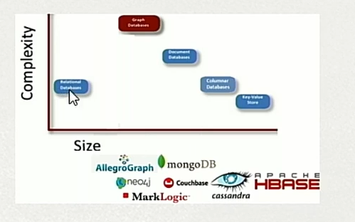
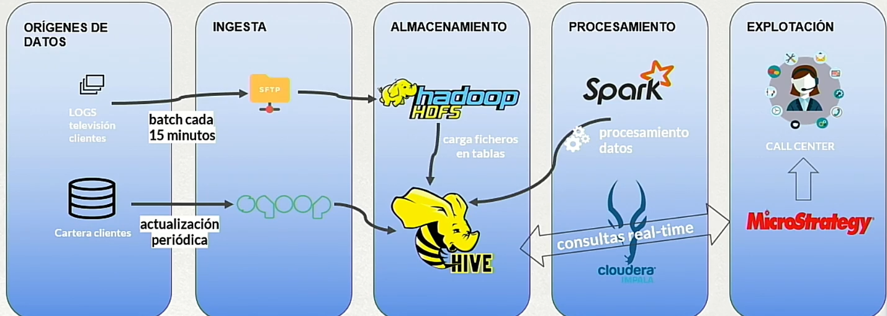

# Curso Big Data 
## Introducción 
### La iformática tradicional : de la calculadora a la computación distribuida.
Tomamos al ábaco como punto de partida/ antecedente de la programación. La informática evolucionó en múltiples ámbitos y finalidades. 
Este curso se centra en el Tratamiento de Datos. 
El tratamiento de datos se puede entender como el proceso de:
1. Recolectar
2. Almacenar
3. Procesar 
4. Visualizar. 

El tratamiento de datos es fundamental en el mundo empresarial. Los recursos necesarios van proporcionalmente a la cantidad de datos a tratar. 
Para ello utilizacermos la escalabilidad vertical, que consiste en aumentar sus recursos o mejorarla por uno mas grande. Aunque esto tiene sus 
limitaciones ya que llega un momento que el computador no se puede ampliar más. Como solición a esto se aplica la parábola de bueyes de Grace Hopper, 
que consiste en la computación distribuida o escalado horizontal. Tener varios ordenadores y que trabajen de manera sumatoria para sumar sus recursos.

### Antecedentes en Big Data : limitaciones de la computación distribuida.

Esto se basa principalmente en la división de datos y distribución a los diferentes ordenadores que lo procesan de forma "unisona" los procesan y vuelven a enviarlas para unificarlas y sacar una única salida con el conjunto de esos datos.   

A mas datos, el procesamiento de partir/dividir el dato se verá incrementado. Por lo que si aumentan los datos/computadores, aumentaran los cuellos de botella. Tiene un limite de crecimiento. 

### La clave de Big data : la localización del dato.

Big Data también es Computación distribuida y Almacenamiento DIstribuido, este realiza el procesamiento más allá donde está el dato (Data Locality).  
Lo que hace es no mover el dato si no mover el procesamiento. No existe un sistema de almacenamiento centralizado. Desaparecen fases y con ellas los cuellos de botella. 

## Entender qué es Big Data. 

La ventajas e innovaciones de Big Data se resumen en 3Vs. 
Son velocidad, volumen y variabilidad. 

### Volumen : datos hasta el infinito
Se empieza a hablar en Terabytes, Petabytes, Exabytes... El almacenamiento es propio de los servidores, por lo que a mas servidores más almacenamiento. Al resolver la tecnología obsoleta que causaba cuello de botella podemos tener números de servidores ilimitado por lo que obtendremos almacenamiento limitado.  

### Velocidad : aparece el concepto de streaming
Procesamiento Batch (por lotes) más rápido que lo tradicional. Se pueden procesar los datos segun se genera -> **Streaming**.
Aparece el concepto de "Real Time". Al almacenarse de forma distribuida, nada más se almacena se le aplica el procesamiento, existe un delay pero es casi nulo en la mayoría de los casos.

### Variabilidad : cualquier cosa se transforma en dato utilizable. 
Tratamiento de datos tradicional -> datos estructurados.   
Big Data --> cualquier dato:
1. Estructurado
2. Semi-estructurado
3. Des-estructurado

Todo elemento que genera datos -> fuente de datos para Big Data.   
Variabilidad que todo elemento que genere un dato, son susceptibles a ser tratados en una plataforma Big Data. 

### Hay más V's, pero compuestas de estas 3. 
Se pueden encotrar otras Vs como Veracidad, Viabilidad, Valor y Visualización. El resto de Vs son una consecuencia de las principales y variaciones. 

- Veracidad: Verificación de datos.   
- Valor: Ya que Big Data aporta valor, por lo que es una propiedad   intrinseca.  
- Viabilidad: Accesibilidad de datos.  
- Visualización: Hay muchas mas herramientas para la visualización, por lo que más posibilidades.    

## Big Data y el Negocio 
### Nuevas Oportunidades de negocio
Gracias a las 3Vs, los negocios pueden jugar con cualquier tipo de dato en cualquier momento y con cualquier cantidad. Se dice que hoy en día es el nuevo oro. También se dice que en "internet cuando algo es gratis, el pago eres tú". 

A más cantidad de datos o muestra más grande más concreta puede ser la conclusión.

### Nuevas Oportunidades laborales
BigData no requiere únicamente de perfiles informáticos. Con la nuevas oportunidades cobrarán peso todo tipo de perfiles. Incluso aparecen nuevos perfiles no técnicos en torno a los datos. 
Perfiles que cuiden controlen los datos que tenemos, quien acceden, como se van a explotar esos datos, que se cumplan las legislaciones. Los datos son el principal activo de una empresa. 

### Perfiles técnicos de trabajo en Big Data.
Analista de Datos / Data Analytics o Scientist.   
Este perfil se encarga de analizar los datos, conocer las herramientas como base de datos, algoritmos. Machine Learning, IA. Es el más demandado a nivel técnico. Sabe el requisito de negocio, y saber que algoritmo e información se puede extraer de ahi, presentar gráficos que explote la capacidad de los datos. 

Desarrollador / Data Engineer.   
Perfil que programa en framework, en lenguajes propios de Big Data y lenguajes tradicionales. El que pone en código los requisitos que se quieran implementar para tratar esos datos.

Administrador / Big Data Sysadmin.   
Despliegue las máquinas, redes, base de datos, hardware. Este perfil se encarga de montar los servidores. Las soluciones de Big Data instalarlas, configurarlas, optimizarlas y mantenerlas. 

## Plataform Big Data
### ¿Que es un cluster?
El cluster es un conjunto de servidores que trabajan coordinados. Existen muchos tipos de cluster, según el producto que lo conforme. 
Algun ejemplo sería, cluster de maestro esclavo, el maestro tiene una réplica que cuando el maestro no funciona, entra el esclavo y pasa a ser maestro y sigue dando servicio. 
El principal función de esto es la persistencia de los servicios dados en caso de que algún servidor falle. 

### Tipos de servidores cluster
Según el producto, el cluster tendrá unos tipos de servidores u otros. En Big Data tendremos el cluster Hadoop.
- Maestros (Master): Coordinan el cluster. Dicen que hay que coger y como procesar. 
- Trabajadores(Workers): Alojan y procesan los datos. Tanto el maestro como el trabajador son imprescindibles. 
- Ingesta(Gateway o EdeNodes): Conexión del cluster con el exterior. Ya sea a internet o a otra red. Ya que el cluster debe estar en una red aislada. Conectar nuestra plataforma con el exterior, con las diferentes fuentes de datos. 
- Utilidades(UtilityNodes):Servicios adicionales. Base de datos, Servicio de seguridad, monitorización. Alguna funcionalidad aparte del almacenamiento. 

Ampliar el número de Workers amplían el procesamiento y el almacenamiento del cluster. Los maestros no aportan almacenamiento ni computo. 

### Que se considera una Plataforma Big Data
Cluster Hadoop es el core de una plataforma Big Data. Pero Big Data no sólo es Hadoop. Una plataforma Big Data engloba más tecnologías y se puede considerar un conjunto de capas. 

#### Capas de una plataforma Big Data.

- Explotación: Es la manera de visualización, ya sea con gráficas, reportes. Se pueden utilizar una grán cantidad de herramientas. Puede ser Ajena a Big Data, incluidas desde herramientas tradicionales introducidas en la nueva plataforma big data. Agrupa componentes según finalidad. 
- Analítica/Procesamiento: Una vez almacenado lo procesaremos, depende del encargado o finalidad se le da más peso a la analítica o al procesamiento.  Minería de datos, se puede meter machine learning, IA o cualquier tema que trate el Dato. 
- Almacenamiento: Aunque se procese al momento hay que almacenarlo,  previamente a borrarlo tras su procesamiento. Bases de datos se agrupan en la capa de almacenamiento. Bases de datos no sql, no es Hadoop pero si es Big Data. 
- Ingesta: Argupación de componentes, cogerán los datos y lo almacenarán en nuestro cluster. Los dos tipos de susbtracciṕn de datos va a ser por lotes cada cierto tiempo(Batch) o en streaming que es "inmediato.". Como el origen de dato puede ser cualquiera, ya sea estructurado o desestructurado que atribuye al atributo de variabilidad.
- Orígenes de datos: Aquí tenemos todas las fuentes en las que vamos a trabajar, como redes sociales, noticias, servicios del cloud. Cualquier dato susceptible de ser procesado va a estar aquí. 

Las capas agrupan componentes y tecnologia por finalidad. 
La capa más externa es la de administración, que se encarga de la seguridad y gobierno de datos. Aqui se encuentra el rol de la seguridad del dato y de hacer un seguimiento y controlarlos. 

Capa vertical que da soporte a todo es la Administración. Controlar ingesta, componentes software, cuando se pasan a explotación, fuentes y reportar cualquier problema. Herramientas para gestionar la plataforma a nivel global. La capa de seguridad cada vez más importante.   
El gobierno del dato: tiene que velar por la calidad del dato, quien accede, donde se ha generado el dato y por donde ha pasado, su modificación y quien ha accedido al dato. En general trazar la vida de cada dato. 

## Hadoop: Core tecnológico de Big Data
### Apache Hadoop: core tecnológico de Big Data
Apache Hadoop es la tecnología que proporcionó cumplir las 3Vs del Big Data. Pertenece al proyecto Apache y tiene una de las mayores comunidades activas. Framework de almacenamiento distribuido y computación distribuida que permitia programar y trabajar sobre grandes conjuntos de datos. Nació sobre software libre sobre el "paraguas" Apache. Es open source. 

### Historia de Apache Hadoop.

- Motor indexación: Es un sistema diseñado para analizar, procesar y organizar datos en un índice, lo que permite búsquedas rápidas y eficientes. En el contexto de los motores de búsqueda, el motor de indexación transforma contenido web en un formato que el buscador puede consultar rápidamente.

- Buscador Distribuido: Se refiere a un sistema de búsqueda que está distribuido en múltiples nodos o servidores para mejorar la escalabilidad, la velocidad y la tolerancia a fallos. Esto es común en buscadores como Google, donde el índice y las consultas están divididos entre muchos servidores.

- GFS: Es un sistema de archivos distribuido desarrollado por Google, diseñado para manejar grandes cantidades de datos a través de múltiples servidores. Está optimizado para lecturas frecuentes y escrituras secuenciales de datos en volúmenes masivos, garantizando alta disponibilidad y tolerancia a fallos.

- Map/Reduce: Es un modelo de programación y un framework desarrollado por Google para procesar grandes cantidades de datos distribuidos. Consta de dos fases principales:

    - Map: Divide los datos en partes más pequeñas y los procesa en paralelo.
    - Reduce: Combina los resultados parciales del procesamiento para generar una salida consolidada. Es ideal para tareas como conteo de palabras, clasificación y análisis de datos masivos.

### HDFS y YARN: Almacenamiento y procesamiento como punto central.

HDFS: Almacenamiento (Parte y replica)
- Hadoop Distributed File System
- Sistema de almacenamiento Hadoop
- Apariencia de un único sitema de ficheros similar a Linux.
- Es altamente escalable y tolerante a fallos. 

Cada dato se partirá en bloques para que sea más facil trabajar y replicará cada bloque en 3 por defecto y lo repartirá en 3 máquinas distintas. 
Está pensado para el fallo, ya que siempre habrá una copia para los datos. 

Map/Reduce: Procesamiento (Mapeo y Reduccion)
- MapReduce permite el procesamiento distribuido sobre HDFS.
- Permite obtener Data Locality (revolución tecnológica de Big Data)
- Es el primer paradigma de programación Hadoop.
    - Con una fase de mapeo (Map) y otra de agrupacio (Reduce)
- Su funcionamiento lo ilustra un "Contar Palabras"

HDFS parte el dato en bloques más pequeños y los distribuye en máquinas. 
El procesamiento va al dato, mapreduce se ejecuta sobre la máquina que ya tiene el dato. 
Trabajan en conjunto para que el dato tenga que apenas moverse por la red. 

YARN: Gestión de recursos
- YARN gestiona los recursos(CPU y RAM) del cluster para procesar.
- Es tolerante a fallos y permite multitud de ejecuciones en paralelo.
- Gestiona cuotas de ejecución según prioridad, necesidad, disponibilidad...
- Apareció con MapReduce, pero puede trabajar con otros frameworks de procesamiento como Spark. 

Reparte el procesamiento según lo requerido. Permitía que trabajando sobre hdfs y hadoop, otros frameworks se incorporasen aparte de MapReduce como Spark. 

### Ecosistema Hadoop: Diferentes productos para diferentes finalidades. 

- **Apache Flume**: Herramienta de recolección, agregación y transporte de grandes cantidades de datos provenientes de múltiples fuentes hacia un sistema centralizado, como HDFS.

- **Apache Sqoop**: Herramienta diseñada para transferir datos de manera eficiente entre bases de datos relacionales y Hadoop, permitiendo exportar e importar datos.

- **Apache ZooKeeper**: Servicio centralizado para la gestión de configuración, sincronización distribuida y coordinación de servicios en aplicaciones distribuidas.

- **Apache Oozie**: Sistema de orquestación de flujos de trabajo para ejecutar trabajos de Hadoop basados en dependencias temporales o de ejecución.

- **Apache Ambari**: Plataforma para la gestión, monitoreo y configuración de clústeres de Hadoop de manera sencilla a través de una interfaz gráfica.

- **Apache Pig**: Lenguaje de alto nivel para el procesamiento de datos en Hadoop. Utiliza scripts para describir flujos de datos complejos.

- **Apache Hive**: Herramienta que proporciona un sistema de almacenamiento de datos tipo almacén de datos, que permite consultas SQL (HiveQL) sobre grandes volúmenes de datos en Hadoop.

- **Apache HBase**: Base de datos NoSQL distribuida y escalable que se ejecuta sobre HDFS, diseñada para operaciones de lectura y escritura en tiempo real.

Hay una gran cantidad componentes que trabajan de manera nativa como HDFS y YARN. Algunos también del proyecto apache. Y otros no como por ejemplo Jupyter, presto o cloudera. Pero a todo el conjunto se le considera como Ecosistema Hadoop. 

### Ubicar los componentes en sus capas correspondientes. 
Hay una grán cantidad de productos en el mundo Big Data, tanto dentro como fuera del ecosistema Hadoop. Importante 
ubicar el producto en las capas de la Plataforma Big Data.
[Herramientas Data IA](http://mattturck.com/wp-content/uploads/2019/07/2019_Matt_Turck_Big_Data_Landscape_Final_Fullsize.png)

Distribución de los principales componentes Big Data en sus capas correspondientes.

### Hadoop es al Big Data lo que Linux a los Sistemas Operativos
Apache Hadoop es software libre, pero sin un soporte oficial por parte de Apache como Linux. 
Hay empresas que ofrecen soporte comercial sobre software libre tanto en linux como Hadoop.
Hadoop sería comparable a Linux. Cloudera y Hortonworks son en hadoop como Red Hat y Ubuntu en Linux. 

## Proveedores de productos Big Data
### Plataformad Apache Hadoop: Cloudera Hortonworks
Al instalar hadoop se instalará una plataforma Big Data. Instalar a mano hadoop es casi inviable por lo que hay que recurrir a plataformas Big Data. 
En plataformas Hadoop líderes dos empresas : CLoudera y Hortonworks. Estas tienen ya componentes en todas las capas. Cloudera es más empresarial y privativa, y horton Viene más de apache. 

#### Comparativa 
Cloudera:
- Tiene componentes propios 
- No soporta cualquier componente de Hadoop. 
- Cloudera manager como administrador
- Software propio
- Obligatorio licencia para su uso empresarial. 
    - Incluye soporte.

Hortonworks:
- Componentes 100% Apache Hadoop
- Soporta cualquier componente de Hadoop.
- Ambari Server como administrador. 
- Software open source
- No requiere licencia para su uso empresarial
    - Se puede contratar soporte. 

Llegó un momento donde ambas empresas se fusionaron donde 55% cloudera y 45% horton. 

### Base de Datos NoSQL
Base de datos no SQL se engloban en las tecnologías BigData. 
En BigData hay muchas bases de datos no SQL que no pertenecen al ecosistema Hadoop. Se pueden agrupar según su funcionamiento, su estructura y complejidad:
 

### Cloud: soluciones Hadoop, productos PaaS
En cloud ofrecen Plataformas Hadoop propias. Además de plataformas hay productos Paas concretos. Existe un amplio port-folio de productos BigData en Cloud.

Paas
- **Amazon AWS**: Plataforma en la nube que ofrece una amplia variedad de servicios como cómputo, almacenamiento, redes y análisis de datos, diseñados para escalar y soportar aplicaciones modernas.

- **Google Cloud Platform**: Conjunto de servicios de computación en la nube que incluye almacenamiento, análisis, inteligencia artificial y herramientas de desarrollo, todo integrado en una infraestructura global.

- **Microsoft Azure**: Plataforma de servicios en la nube que proporciona soluciones de cómputo, almacenamiento, redes y aplicaciones empresariales con integración sencilla en entornos híbridos.

## Plataformas Completas

- **Amazon EMR**: Servicio de clústeres de big data en la nube para procesar y analizar grandes cantidades de datos utilizando herramientas como Apache Spark y Hadoop.

- **Azure HDInsight**: Servicio de análisis en la nube basado en Apache Hadoop, que permite manejar y procesar grandes cantidades de datos con escalabilidad y soporte para múltiples frameworks.

- **Confluent**: Plataforma de gestión y procesamiento de flujos de datos basada en Apache Kafka, diseñada para la integración en tiempo real y el análisis continuo.

- **Spark Databricks**: Plataforma de análisis y procesamiento de big data optimizada para Apache Spark, con características avanzadas como machine learning y colaboración en tiempo real.

## Ejemplos de aplicación Big Data
### Industria : Mejora de tiempos en procesos de larga duración. 
- Existia un proceso que cargaba la información de unas bases de datos, las procesaba y exportaba a una base de datos de la que se montaban gráficos con la información procesada. 
- El proceso es similar, pero haciendo uso de tecnologias Big Data, permitió reducir el tiempo en un 75%. 
Estructura. 

No hemos tocado la capa de explotación ni la de origen, solo capas intermedias ejecutando un procesamiento adecuado al Big Data. 

### Operadora Televisión: Análisis de la calidad de señal de televisión. 
- Se recogen los logs de todos los decodificadores de cliente, se almacenan y procesan para que el Call Center tenga un cuadro de mandos actualizado con los indicadores de la TV de cada cliente: calidad de la señal, cortes, canales, etc. 

### Debate político : conocer en tiempo real las respuesta de los votantes en las rrss.
- Se muestran los candidatos resultados a tiempo real de las publicaciones en redes sociales
que se van produciendo. 

