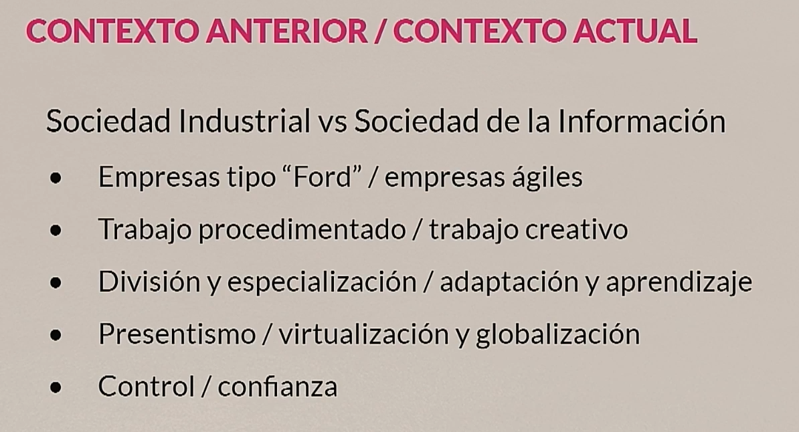

# Taller : Inteligencia Artificial.
## ¿Que es la IA?
Es la capacidad de tomar decisiones de forma automatizada, en base a procesar grandes cantidades de datos. 
Esta inteligencia surge del ahorro de tiempo que supondría respecto al cálculo humano en la misma tarea. 
Un Robot es un ente(fisico o no) automatizado con más o menos inteligencia. 
Un robot puede no tener inteligencia, como la lavadora, ya que no aprende en cada interacción con el usuario. 

La IA es un concepto mucho más global, no sólo es el futuro, es el presente.
La hiperpersonalización es aprender como lo haces tu en concreto. 
La TD implica generación de datos, y su uso puede llevar a implementar IA. 
Cualquier cosa que hacemos genera un dato, esta es la fuente de la Inteligencia Artificial. Puede ser Aprendizaje supervisado o no supervisado. 

Terminología en Inteligencia Artificial. 
- **Big Data**
Big Data hace referencia a conjuntos de datos extremadamente grandes y complejos que no pueden ser procesados o analizados mediante métodos tradicionales. Estos datos suelen ser generados a gran velocidad y provienen de diversas fuentes, como redes sociales, dispositivos IoT, transacciones en línea y más. El manejo de Big Data implica tecnologías especializadas para el almacenamiento, análisis y visualización.

---

- **Blockchain**
Blockchain es una tecnología de registro distribuido que almacena datos en bloques enlazados y asegurados mediante criptografía. Esta tecnología permite transacciones seguras y transparentes, eliminando la necesidad de intermediarios de confianza. Es ampliamente utilizada en criptomonedas como Bitcoin y Ethereum, así como en aplicaciones relacionadas con contratos inteligentes, logística y trazabilidad.

---

- **Data Analytics**
Data Analytics se refiere al proceso de examinar conjuntos de datos para extraer información útil, identificar patrones y tomar decisiones informadas. Incluye técnicas descriptivas, predictivas y prescriptivas para analizar datos estructurados y no estructurados, y es ampliamente utilizada en negocios, salud, marketing y más.

---

- **Machine Learning**
Machine Learning (Aprendizaje Automático) es una rama de la Inteligencia Artificial que permite a las máquinas aprender y mejorar su rendimiento en tareas específicas sin ser explícitamente programadas. Utiliza algoritmos que analizan datos, detectan patrones y hacen predicciones o decisiones basadas en el aprendizaje adquirido. Ejemplos incluyen el reconocimiento de voz, la clasificación de imágenes y los sistemas de recomendación.

---

- **Data Mining**
Data Mining (Minería de Datos) es el proceso de descubrir patrones, relaciones y conocimientos útiles en grandes conjuntos de datos mediante técnicas de análisis avanzadas. Combina herramientas de estadística, aprendizaje automático y bases de datos para encontrar tendencias y comportamientos relevantes. Es comúnmente utilizado en marketing, detección de fraudes y análisis de redes sociales.

---

- **Inteligencia Artificial**
La Inteligencia Artificial (IA) es un campo de la informática que busca crear sistemas capaces de realizar tareas que normalmente requieren inteligencia humana. Estas tareas incluyen aprendizaje, razonamiento, percepción, comprensión del lenguaje natural y toma de decisiones. La IA abarca subcampos como el Machine Learning, el procesamiento de lenguaje natural (NLP) y la visión por computadora.

---

## Retos superados y no superados
### Superados
- IoT, IoE, redes sociales, Industria 4.0
- Reto superado: Big Data. "Tiempo real".
- Casos de aplicación de IA con éxito, tan fiables que nuestra vida depende de ellos: pilotos automáticos, vehículos autónomos, Smart grids, etc. 

### No Superados
- Multiplicar las aplicaciones de IA sin inventar la rueda cada vez. 
- Smart Data. Smart Visual Data. 
- Datos en TPV. Monetizan los insights, no los datos. 
- Comprar y utilizar insights es más rapido que comprar y procesar teras de datos...
- Smart Contracts (Blockchain)

## Contexto actual de innovación
- Las empresas más innovadoras dan tiempo para la exploración, la experimentación...
- NFTs, BlockChain, Smart Contracts, DAOs...
- DAOs: es una empresa con unas reglas preescritas con algoritmos de inteligencia artificial que se van mejorando. Organización Descentralizada Autonoma. Aprende sobre la decisión de las reglas. 

También adaptarse al nuevo entorno físico consecuente con la transformación digital:
- Menos papeles, más espacio físico en la oficina.
- Uso obligado de exoesqueletos.
- Aceptar la monitorización constande de nuestra actividad. 
- Minimización de tareas "simples y repetitivas", que serán automatizadas. 

## ¿Que se nos pide en este contexto?
- Nativos ágiles / digitales
- No limitar nuestros conocimientos, fallar y aprender. 

## Robótica
La industria automovilística es una de las más robotizada, la que más puesto de trabajo genera en el mundo. 
Un robot no es una máquina con inteligencia. 
- Mediante algoritmos potencial el valor que se puede aportar a la empresa de los empleados.

## Tendencias a corto, medio y largo plazo. 
Aparece Edge Computing. Procesamiento en local: aliviar tiempos y volúmenes de comunicación. 
Tiempos de comunicación acelerados por 5G. 
Procesamiento acelerado por Quantum Computing. 

Nuevo Ecosistema tecnológico.
- **IoE (Internet of Everything)**
El Internet of Everything (IoE) es la evolución del Internet of Things (IoT). IoE conecta personas, procesos, datos y objetos para crear redes más inteligentes y optimizadas. Su objetivo es mejorar la toma de decisiones, aumentar la eficiencia operativa y ofrecer experiencias personalizadas a través de una integración más profunda de tecnologías.

---

- **5G**
5G es la quinta generación de tecnologías de redes móviles. Ofrece velocidades significativamente más rápidas, menor latencia y mayor capacidad que las generaciones anteriores. 5G habilita aplicaciones avanzadas como vehículos autónomos, realidad aumentada/virtual y comunicaciones masivas en tiempo real, siendo un pilar fundamental para el desarrollo de IoT y la conectividad global.

---

- **Edge Computing**
Edge Computing se refiere al procesamiento de datos cerca del lugar donde se generan, en lugar de enviarlos a un centro de datos centralizado. Este enfoque reduce la latencia y el consumo de ancho de banda, lo que es crucial para aplicaciones en tiempo real como dispositivos IoT, sistemas de automatización industrial y vehículos conectados.

---

- **Smart Data**
Smart Data es el concepto de procesar y analizar grandes volúmenes de datos para extraer únicamente la información relevante y útil para la toma de decisiones. Se diferencia de Big Data en que prioriza la calidad de los datos frente a la cantidad, enfocándose en información procesable y de alto valor para los negocios.

- **Gemelos Digitales**
El gemelo digital es la reproducción digital exacta de un objeto o ente real. Se aplicará a todo: ingeniería, aeronáutica, construcción e investigación médica. Se espera que cualquier cosa disponga de su gemelo digital en el futuro. Los gemelos digitales requieren comunicar muchos datos (5G).

## Personas Como 
- Líderes ágiles
- Expertos en negocio
- Científico de datos. 
- Analistas de datos. 
- Diseñadores Gráficos. 
- Actitud e innovación. 